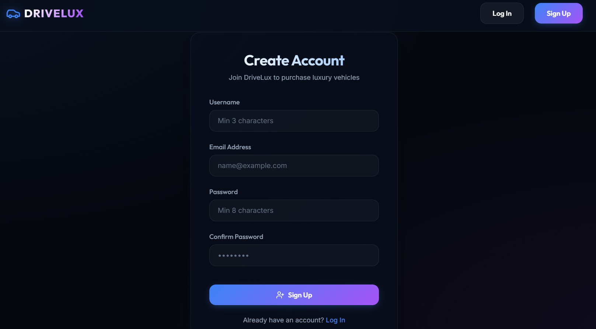
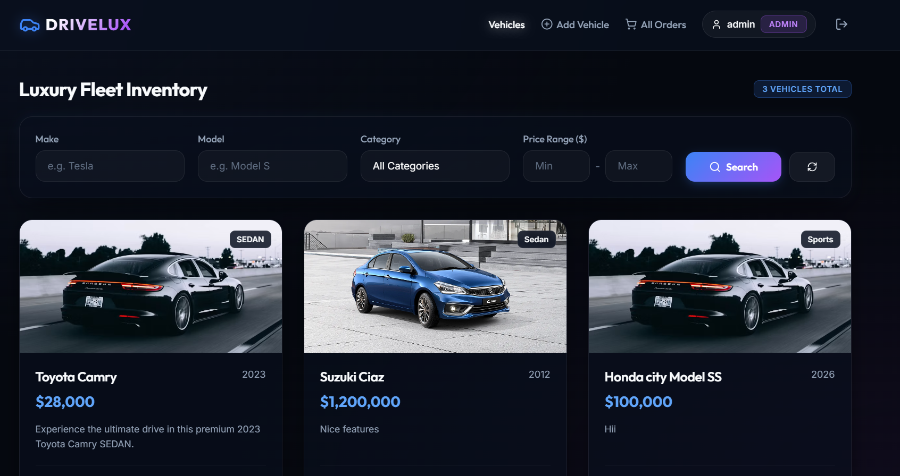
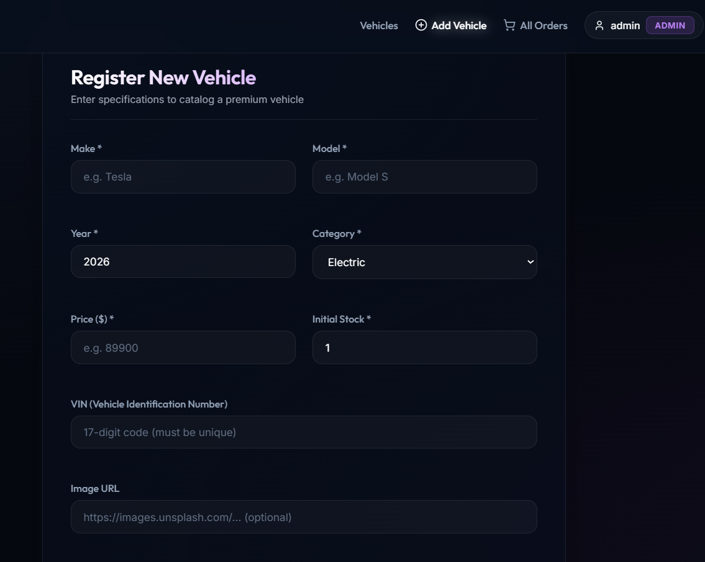
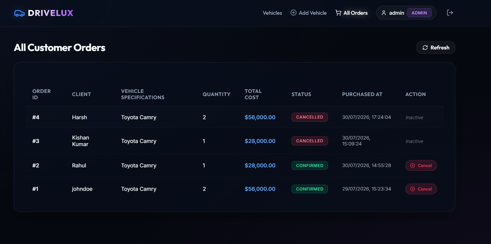

# 🚗 Car Dealership Inventory System

A full-stack Car Dealership Inventory Management System built with **Test-Driven Development (TDD)**, featuring a **Spring Boot** REST API backend secured with **JWT authentication** and a **React** single-page application frontend.

---

## 📋 Table of Contents

- [Project Overview](#-project-overview)
- [Tech Stack](#-tech-stack)
- [Features](#-features)
- [Project Structure](#-project-structure)
  - [Backend Structure](#backend-structure)
  - [Frontend Structure](#frontend-structure)
- [Database Schema](#-database-schema)
- [API Endpoints](#-api-endpoints)
  - [Auth Endpoints](#auth-endpoints)
  - [Vehicle Endpoints](#vehicle-endpoints)
  - [Inventory Endpoints](#inventory-endpoints)
  - [Order Endpoints](#order-endpoints)
- [Getting Started](#-getting-started)
  - [Prerequisites](#prerequisites)
  - [Backend Setup](#backend-setup)
  - [Frontend Setup](#frontend-setup)
- [TDD Approach](#-tdd-approach)
  - [Testing Layers](#testing-layers)
  - [Test Coverage](#test-coverage)
- [Screenshots](#-screenshots)
- [My AI Usage](#-my-ai-usage)

---

## 📌 Project Overview

This application simulates a real-world car dealership inventory system where:

- **Customers** can browse vehicles, search by filters, purchase vehicles, and view their order history
- **Admins** can add, update, delete vehicles, restock inventory, and manage all orders
- All sensitive endpoints are protected with **JWT-based authentication**
- The backend was built following **strict TDD principles** with visible Red-Green-Refactor commit history

---

## 🛠 Tech Stack

### Backend
| Technology | Version | Purpose |
|---|---|---|
| [Java](https://www.oracle.com/java/technologies/javase/jdk21-archive-downloads.html) | 21 (LTS) | Primary language |
| [Spring Boot](https://spring.io/projects/spring-boot) | 3.5.4 | Application framework |
| [Spring Security](https://spring.io/projects/spring-security) | 6.5.x | Authentication and authorization |
| [Spring Data JPA](https://spring.io/projects/spring-data-jpa) | 3.5.x | Database ORM |
| [PostgreSQL](https://www.postgresql.org/) | 16 | Relational database |
| [JJWT](https://github.com/jwtk/jjwt) | 0.12.6 | JWT token generation and validation |
| [Lombok](https://projectlombok.org/) | 1.18.x | Boilerplate reduction |
| [SpringDoc OpenAPI](https://springdoc.org/) | 2.5.0 | Swagger UI / API documentation |
| [JUnit 5](https://junit.org/junit5/) | 5.12.x | Unit and integration testing |
| [Mockito](https://site.mockito.org/) | 5.17.x | Mocking in tests |
| [Testcontainers](https://testcontainers.com/) | 1.21.1 | Real PostgreSQL in tests |
| [JaCoCo](https://www.jacoco.org/jacoco/) | 0.8.12 | Test coverage reporting |
| [AssertJ](https://assertj.github.io/doc/) | 3.27.x | Fluent test assertions |

### Frontend
| Technology | Version | Purpose |
|---|---|---|
| [React](https://react.dev/) | 18.x | UI framework |
| [Vite](https://vitejs.dev/) | 5.x | Build tool and dev server |
| [React Router DOM](https://reactrouter.com/) | 6.x | Client-side routing |
| [Axios](https://axios-http.com/) | 1.x | HTTP client |
| [Tailwind CSS](https://tailwindcss.com/) | 3.x | Utility-first CSS framework |
| [Lucide React](https://lucide.dev/) | 0.x | Icon library |

---

## ✨ Features

### Customer Features
- 📝 Register a new account
- 🔐 Login with JWT-secured session
- 🚗 Browse all available vehicles with pagination
- 🔍 Search and filter vehicles by make, model, category, and price range
- 🛒 Purchase a vehicle (button disabled when out of stock)
- 📦 View personal order history
- ❌ Cancel an existing order (restocks vehicle automatically)

### Admin Features
- ➕ Add new vehicles to inventory
- ✏️ Update vehicle details (full update via PUT, partial via PATCH)
- 🗑️ Soft delete vehicles (marks as inactive, not permanently removed)
- 📦 Restock vehicle quantity
- 📋 View all orders across all customers
- 📊 View complete transaction history per vehicle

### Security Features
- 🔒 Stateless JWT authentication (2-hour token expiry)
- 🛡️ Role-based access control (CUSTOMER vs ADMIN)
- 🌐 CORS configured for React dev server (`localhost:5173`)
- 🔑 BCrypt password hashing
- 🚫 All protected endpoints return 401/403 without valid token

---

## 📁 Project Structure

### Backend Structure

```
car-dealership-backend/
├── src/
│   ├── main/
│   │   ├── java/com/dealership/
│   │   │   ├── config/
│   │   │   │   ├── SecurityConfig.java        # JWT filter chain, role-based rules
│   │   │   │   ├── CorsConfig.java            # CORS for React frontend
│   │   │   │   └── OpenApiConfig.java         # Swagger UI configuration
│   │   │   ├── controller/
│   │   │   │   ├── AuthController.java        # /api/auth/**
│   │   │   │   ├── VehicleController.java     # /api/vehicles/**
│   │   │   │   ├── InventoryController.java   # /api/vehicles/{id}/purchase|restock
│   │   │   │   └── OrderController.java       # /api/orders/**
│   │   │   ├── dto/
│   │   │   │   ├── request/
│   │   │   │   │   ├── RegisterRequest.java
│   │   │   │   │   ├── LoginRequest.java
│   │   │   │   │   ├── CreateVehicleRequest.java
│   │   │   │   │   ├── UpdateVehicleRequest.java
│   │   │   │   │   ├── PatchVehicleRequest.java
│   │   │   │   │   ├── PurchaseRequest.java
│   │   │   │   │   └── RestockRequest.java
│   │   │   │   └── response/
│   │   │   │       ├── AuthResponse.java
│   │   │   │       ├── UserResponse.java
│   │   │   │       ├── VehicleResponse.java
│   │   │   │       ├── OrderResponse.java
│   │   │   │       ├── TransactionResponse.java
│   │   │   │       └── ErrorResponse.java
│   │   │   ├── entity/
│   │   │   │   ├── User.java
│   │   │   │   ├── Vehicle.java
│   │   │   │   ├── InventoryTransaction.java
│   │   │   │   └── Order.java
│   │   │   ├── repository/
│   │   │   │   ├── UserRepository.java
│   │   │   │   ├── VehicleRepository.java
│   │   │   │   ├── InventoryTransactionRepository.java
│   │   │   │   └── OrderRepository.java
│   │   │   ├── service/
│   │   │   │   ├── AuthService.java / AuthServiceImpl.java
│   │   │   │   ├── VehicleService.java / VehicleServiceImpl.java
│   │   │   │   ├── InventoryService.java / InventoryServiceImpl.java
│   │   │   │   └── OrderService.java / OrderServiceImpl.java
│   │   │   ├── security/
│   │   │   │   ├── JwtUtil.java               # Token generation & validation
│   │   │   │   ├── JwtAuthenticationFilter.java # Per-request token extractor
│   │   │   │   └── CustomUserDetailsService.java
│   │   │   ├── exception/
│   │   │   │   ├── UserAlreadyExistsException.java
│   │   │   │   ├── InvalidCredentialsException.java
│   │   │   │   ├── VehicleNotFoundException.java
│   │   │   │   ├── InsufficientStockException.java
│   │   │   │   ├── OrderNotFoundException.java
│   │   │   │   ├── UnauthorizedException.java
│   │   │   │   └── GlobalExceptionHandler.java
│   │   │   └── CarDealershipInventorySystemApplication.java
│   │   └── resources/
│   │       └── application.properties
│   └── test/
│       └── java/com/dealership/
│           ├── repository/          # @DataJpaTest + Testcontainers
│           │   ├── UserRepositoryTest.java
│           │   └── VehicleRepositoryTest.java
│           ├── service/             # Pure Mockito unit tests
│           │   ├── AuthServiceTest.java
│           │   ├── VehicleServiceTest.java
│           │   ├── InventoryServiceTest.java
│           │   └── OrderServiceTest.java
│           ├── controller/          # @WebMvcTest slice tests
│           │   ├── AuthControllerTest.java
│           │   ├── VehicleControllerTest.java
│           │   ├── InventoryControllerTest.java
│           │   └── OrderControllerTest.java
│           └── integration/         # @SpringBootTest + Testcontainers
│               ├── BaseIntegrationTest.java
│               ├── AuthIntegrationTest.java
│               ├── VehicleIntegrationTest.java
│               └── OrderIntegrationTest.java
└── pom.xml
```

### Frontend Structure

```
dealership-frontend/
├── src/
│   ├── components/
│   │   ├── Modal.jsx          # Reusable modal dialog
│   │   ├── Navbar.jsx         # Top navigation with role-aware links
│   │   └── VehicleCard.jsx    # Vehicle display card with purchase button
│   ├── context/
│   │   └── AuthContext.jsx    # JWT storage, current user state, login/logout
│   ├── pages/
│   │   ├── Login.jsx          # Login form → POST /api/auth/login
│   │   ├── Register.jsx       # Register form → POST /api/auth/register
│   │   ├── Vehicles.jsx       # Dashboard — vehicle list + search/filter
│   │   ├── VehicleDetails.jsx # Single vehicle detail + purchase
│   │   ├── AddVehicle.jsx     # Admin: add new vehicle form
│   │   └── Orders.jsx         # Order history page
│   ├── services/
│   │   └── api.js             # Axios instance + all API call functions
│   ├── App.jsx                # Route definitions
│   ├── main.jsx               # React entry point
│   └── index.css              # Global styles
├── index.html
├── vite.config.js
└── package.json
```

---

## 🗄 Database Schema

The application uses **PostgreSQL** with four tables. Hibernate manages schema creation via `ddl-auto=update`.

```sql
-- Users table
CREATE TABLE users (
    id            BIGSERIAL PRIMARY KEY,
    username      VARCHAR(50)  NOT NULL UNIQUE,
    email         VARCHAR(255) NOT NULL UNIQUE,
    password_hash VARCHAR(255) NOT NULL,
    role          VARCHAR(20)  NOT NULL DEFAULT 'CUSTOMER',  -- CUSTOMER | ADMIN
    created_at    TIMESTAMP    NOT NULL DEFAULT now(),
    updated_at    TIMESTAMP    NOT NULL DEFAULT now()
);

-- Vehicles table
CREATE TABLE vehicles (
    id          BIGSERIAL PRIMARY KEY,
    make        VARCHAR(100)   NOT NULL,
    model       VARCHAR(100)   NOT NULL,
    year        INT            NOT NULL,
    category    VARCHAR(50)    NOT NULL,
    price       NUMERIC(12,2)  NOT NULL CHECK (price >= 0),
    quantity    INT            NOT NULL DEFAULT 0 CHECK (quantity >= 0),
    vin         VARCHAR(17)    UNIQUE,
    description TEXT,
    image_url   VARCHAR(500),
    is_active   BOOLEAN        NOT NULL DEFAULT true,   -- soft delete flag
    created_at  TIMESTAMP      NOT NULL DEFAULT now(),
    updated_at  TIMESTAMP      NOT NULL DEFAULT now()
);

-- Inventory transactions audit log
CREATE TABLE inventory_transactions (
    id              BIGSERIAL PRIMARY KEY,
    vehicle_id      BIGINT REFERENCES vehicles(id) ON DELETE CASCADE,
    user_id         BIGINT REFERENCES users(id),
    type            VARCHAR(20)    NOT NULL,   -- PURCHASE | RESTOCK
    quantity_change INT            NOT NULL,   -- negative=purchase, positive=restock
    price_at_time   NUMERIC(12,2),
    created_at      TIMESTAMP      NOT NULL DEFAULT now()
);

-- Orders table
CREATE TABLE orders (
    id          BIGSERIAL PRIMARY KEY,
    user_id     BIGINT REFERENCES users(id),
    vehicle_id  BIGINT REFERENCES vehicles(id),
    quantity    INT            NOT NULL DEFAULT 1,
    total_price NUMERIC(12,2)  NOT NULL,
    status      VARCHAR(20)    NOT NULL DEFAULT 'CONFIRMED',  -- CONFIRMED | CANCELLED
    created_at  TIMESTAMP      NOT NULL DEFAULT now()
);
```

---

## 🔌 API Endpoints

Base URL: `http://localhost:8080`

Interactive docs available at: [`http://localhost:8080/swagger-ui.html`](http://localhost:8080/swagger-ui.html)

---

### Auth Endpoints

| Method | Endpoint | Access | Description |
|---|---|---|---|
| `POST` | `/api/auth/register` | Public | Register new CUSTOMER account |
| `POST` | `/api/auth/login` | Public | Login and receive JWT token |
| `GET` | `/api/auth/me` | Authenticated | Get current logged-in user profile |

**Register request body:**
```json
{
  "username": "johndoe",
  "email": "john@example.com",
  "password": "password123"
}
```

**Login request body:**
```json
{
  "username": "johndoe",
  "password": "password123"
}
```

**Auth response:**
```json
{
  "token": "eyJhbGciOiJIUzI1NiJ9...",
  "username": "johndoe",
  "role": "CUSTOMER"
}
```

---

### Vehicle Endpoints

All vehicle endpoints require a valid JWT in the `Authorization: Bearer <token>` header.

| Method | Endpoint | Access | Description |
|---|---|---|---|
| `GET` | `/api/vehicles?page=0&size=20&sort=price,asc` | Authenticated | Paginated list of active vehicles |
| `GET` | `/api/vehicles/{id}` | Authenticated | Single vehicle detail |
| `GET` | `/api/vehicles/search?make=&model=&category=&minPrice=&maxPrice=` | Authenticated | Filter vehicles by any combination of params |
| `POST` | `/api/vehicles` | ADMIN only | Add new vehicle |
| `PUT` | `/api/vehicles/{id}` | ADMIN only | Full update of vehicle |
| `PATCH` | `/api/vehicles/{id}` | ADMIN only | Partial update (e.g. price only) |
| `DELETE` | `/api/vehicles/{id}` | ADMIN only | Soft delete (sets `is_active=false`) |

**Create/Update vehicle body:**
```json
{
  "make": "Toyota",
  "model": "Camry",
  "year": 2023,
  "category": "SEDAN",
  "price": 28000.00,
  "quantity": 10,
  "vin": "1HGBH41JXMN109186",
  "description": "Reliable and comfortable sedan.",
  "imageUrl": "https://example.com/image.jpg"
}
```

**Patch vehicle body (only fields to change):**
```json
{
  "price": 26500,
  "quantity": 15
}
```

---

### Inventory Endpoints

| Method | Endpoint | Access | Description |
|---|---|---|---|
| `POST` | `/api/vehicles/{id}/purchase` | Authenticated | Purchase a vehicle, decreases quantity, creates order |
| `POST` | `/api/vehicles/{id}/restock` | ADMIN only | Restock a vehicle, increases quantity |
| `GET` | `/api/vehicles/{id}/transactions` | ADMIN only | View full transaction history for a vehicle |

**Purchase request body:**
```json
{
  "quantity": 2
}
```

**Purchase response:**
```json
{
  "message": "Purchase successful"
}
```

**Restock request body:**
```json
{
  "quantity": 20
}
```

---

### Order Endpoints

| Method | Endpoint | Access | Description |
|---|---|---|---|
| `GET` | `/api/orders/me` | Authenticated | Get current user's orders |
| `GET` | `/api/orders` | ADMIN only | Get all orders in the system |
| `DELETE` | `/api/orders/{id}` | Owner or ADMIN | Cancel order and restock vehicle |

**Cancel order response:**
```json
{
  "message": "Order cancelled successfully"
}
```

---

## 🚀 Getting Started

### Prerequisites

Make sure you have the following installed:

| Tool | Version | Download |
|---|---|---|
| JDK | 21+ | [Oracle JDK](https://www.oracle.com/java/technologies/javase/jdk21-archive-downloads.html) or [Adoptium](https://adoptium.net/) |
| Maven | 3.9+ | [maven.apache.org](https://maven.apache.org/download.cgi) |
| PostgreSQL | 16 | [postgresql.org](https://www.postgresql.org/download/) |
| Docker Desktop | Latest | [docker.com](https://www.docker.com/products/docker-desktop/) — required for Testcontainers |
| Node.js | 18+ | [nodejs.org](https://nodejs.org/) |
| IntelliJ IDEA | 2024+ | [jetbrains.com](https://www.jetbrains.com/idea/download/) |
| VS Code | Latest | [code.visualstudio.com](https://code.visualstudio.com/) |

---

### Backend Setup

**1. Clone the repository**
```bash
git clone https://github.com/your-username/car-dealership-inventory-system.git
cd car-dealership-inventory-system/backend
```

**2. Create the PostgreSQL database**

Open pgAdmin or psql and run:
```sql
CREATE DATABASE "CarDealership";
```

**3. Configure application.properties**

Edit `src/main/resources/application.properties`:
```properties
spring.datasource.url=jdbc:postgresql://localhost:5432/CarDealership
spring.datasource.username=postgres
spring.datasource.password=your_password

spring.jpa.hibernate.ddl-auto=update
spring.jpa.show-sql=true
spring.jpa.properties.hibernate.format_sql=true
spring.jpa.database-platform=org.hibernate.dialect.PostgreSQLDialect

jwt.secret=mySecretKeyForDevelopmentChangeInProduction123456
jwt.expiration-ms=7200000
```

**4. Start the backend**

In IntelliJ IDEA, open the project, wait for Maven to download dependencies, then click the **Run** button on `CarDealershipInventorySystemApplication.java`.

Or via terminal:
```bash
mvn spring-boot:run
```

The backend starts at: [`http://localhost:8080`](http://localhost:8080)

Swagger UI available at: [`http://localhost:8080/swagger-ui.html`](http://localhost:8080/swagger-ui.html)

**5. Create an admin user**

After the app starts, insert an admin user directly via SQL (the register endpoint creates CUSTOMER role only):
```sql
INSERT INTO users (username, email, password_hash, role)
VALUES (
  'admin',
  'admin@dealership.com',
  '$2a$10$N.zmdr9k7uOCQb376NoUnuTJ8iAt6Z5EHsM8lE9lBOsl7iKTVKIUi',
  'ADMIN'
);
-- Password is: admin123
```

---

### Frontend Setup

**1. Navigate to the frontend directory**
```bash
cd ../frontend
```

**2. Install dependencies**
```bash
npm install
```

**3. Start the development server**
```bash
npm run dev
```

The frontend starts at: [`http://localhost:5173`](http://localhost:5173)

> Make sure the backend is running on port `8080` before starting the frontend.

---

## 🧪 TDD Approach

This project was built following strict **Test-Driven Development** with the **Red-Green-Refactor** cycle. Every feature was test-first:

```
🔴 RED    → Write a failing test for behaviour that doesn't exist yet
🟢 GREEN  → Write the minimum code to make the test pass
♻️ REFACTOR → Improve code quality without changing behaviour
```

The commit history reflects this pattern — every RED commit fails to compile, every GREEN commit makes those specific tests pass.

### Testing Layers

```
┌─────────────────────────────────────────────────┐
│         Integration Tests (@SpringBootTest)      │
│     Full stack + real Postgres (Testcontainers)  │
├─────────────────────────────────────────────────┤
│       Controller Tests (@WebMvcTest)             │
│   HTTP layer + MockMvc + mocked services         │
├─────────────────────────────────────────────────┤
│         Service Tests (Mockito)                  │
│   Business logic + mocked repositories           │
├─────────────────────────────────────────────────┤
│       Repository Tests (@DataJpaTest)            │
│   JPA queries + real Postgres (Testcontainers)   │
└─────────────────────────────────────────────────┘
```

| Test Class | Type | Tests | What it covers |
|---|---|---|---|
| `UserRepositoryTest` | `@DataJpaTest` | 3 | findByUsername, existsByEmail, existsByUsername |
| `VehicleRepositoryTest` | `@DataJpaTest` | 3 | Pagination, search query with filters |
| `AuthServiceTest` | Mockito | 6 | Register (unique checks, hashing), login (valid, wrong password, not found) |
| `VehicleServiceTest` | Mockito | 6 | CRUD, soft delete, patch partial update |
| `InventoryServiceTest` | Mockito | 4 | Purchase (success, insufficient, zero stock), restock |
| `OrderServiceTest` | Mockito | 7 | getMyOrders, getAllOrders, cancelOrder (owner, admin, unauthorized, not found, already cancelled) |
| `AuthControllerTest` | `@WebMvcTest` | 5 | Register (201, 409, 400), login (200), /me (200) |
| `VehicleControllerTest` | `@WebMvcTest` | 7 | All 7 CRUD endpoints with role checks |
| `InventoryControllerTest` | `@WebMvcTest` | 8 | Purchase, restock, transactions with auth/role checks |
| `OrderControllerTest` | `@WebMvcTest` | 8 | getMyOrders, getAllOrders, cancelOrder with role checks |
| `AuthIntegrationTest` | `@SpringBootTest` | 7 | Full register → login → /me flow with real DB |
| `VehicleIntegrationTest` | `@SpringBootTest` | 10 | Full CRUD + purchase with quantity verified in DB |
| `OrderIntegrationTest` | `@SpringBootTest` | 7 | Full order lifecycle with restock verified in DB |

### Running Tests

**Run all tests:**
```bash
mvn clean test
```

**Run only service layer tests (fast, no Docker needed):**
```bash
mvn test -Dtest="AuthServiceTest,VehicleServiceTest,InventoryServiceTest,OrderServiceTest"
```

**Run only controller tests:**
```bash
mvn test -Dtest="AuthControllerTest,VehicleControllerTest,InventoryControllerTest,OrderControllerTest"
```

**Run integration tests (requires Docker Desktop running):**
```bash
mvn test -Dtest="AuthIntegrationTest,VehicleIntegrationTest,OrderIntegrationTest"
```

### Test Coverage

Generate the coverage report:
```bash
mvn clean test
```

Then open in browser:
```
target/site/jacoco/index.html
```

> Screenshot of coverage report goes here

---

## 📸 Screenshots

> Add your screenshots below by replacing the placeholder paths.

### Login Page


### Register Page


### Vehicle Dashboard


### Vehicle Detail & Purchase


### Admin — Add Vehicle


### Order History


### Swagger API Documentation


### Test Results


### JaCoCo Coverage Report


---

## 🤖 My AI Usage

### Tools Used
- **Claude (Anthropic)** — primary AI assistant used throughout the project

### How I Used AI

| Phase | What AI helped with |
|---|---|
| **Project planning** | Brainstorming API endpoint structure, deciding which extra endpoints (orders, transactions, analytics) would strengthen the project |
| **Database design** | Reviewing schema design, suggesting the `inventory_transactions` table for audit trail |
| **TDD scaffolding** | Generating first-draft test cases for each layer (repository, service, controller, integration) which I then reviewed, corrected assertions on, and extended with edge cases |
| **Security config** | Helping debug the Spring Security filter chain order and CORS configuration |
| **Boilerplate** | Generating initial DTO classes, exception handlers, and entity structure |
| **Debugging** | Diagnosing the `lower(bytea)` PostgreSQL JPQL error, the `AutoConfigureTestDatabase` package change in Spring Boot 3.x, and the `@MockBean` → `@MockitoBean` migration for Spring Boot 3.4+ |
| **Frontend connection** | Advising on Axios interceptor setup, CORS configuration, and JWT token flow between React and Spring Boot |

### What I Did Manually
- All business logic decisions (role rules, stock validation, cancel-restocks-vehicle behaviour)
- Reviewing every AI-generated test to verify it actually tested real behaviour (not just mock return values)
- Fixing edge cases AI missed (e.g. cancel of already-cancelled order, admin cancelling another user's order)
- Security configuration decisions and endpoint permission ordering
- Frontend UI design and component structure

### Reflection

AI was most valuable for **eliminating repetitive boilerplate** and giving me a fast first draft of tests to react to and improve. The biggest learning: AI-generated tests often assert what the mock returns rather than what the real system does — I rewrote several early tests after catching this. Using AI as a starting point rather than a final answer was the right approach and saved significant time without sacrificing understanding.

---

## 📄 License

This project was built as part of a technical assessment kata. All code is original, written by the author with AI assistance as documented above.

---

## 👤 Author

**Rahul**
- GitHub: [@your-username](https://github.com/your-username)
- Email: your-email@example.com

---

> 📝 See [PROMPTS.md](./PROMPTS.md) for the complete AI tooling chat history as required by the assessment guidelines.
